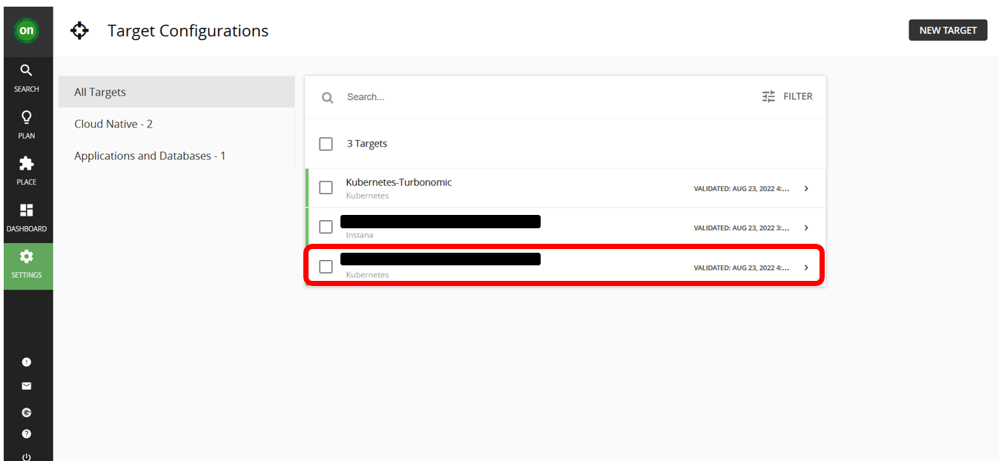

<AnchorLinks>
  <AnchorLink>4-1: Prerequisites</AnchorLink>
  <AnchorLink>4-2: Deploy the Operator</AnchorLink>
  <AnchorLink>4-3: Configure KubeTurbo Instance</AnchorLink>
  <AnchorLink>4-4: Validate Deployment</AnchorLink>
</AnchorLinks>

## 4-1: Prerequisites

1) As a cluster administrator, create a project in the OCP cluster where KubeTurbo will be deployed. Navigate to `Home -> Projects` and click on `Create Project` button. Fill in details as below.

- Name: `kubeturbo-operator`
- Display Name: `Operator Hub based deployment of kubeturbo`


2) Click on `Create` button.

***

## 4-2:  Deploy the Operator

1) Click on `Operators -> OperatorHub`. Ensure the `kubeturbo-operator` project is selected in the dropdown.

2) Search for `kubeturbo` keyword and select `Certified` KubeTurbo operator (note, do not use Community edition)


3) Select and click on `Install` button.


4) Click `Install`, and set up the operator for `Manual`, to be installed in a `specific namespace` (select the cluster you have created in previous section). Automatic update is not recommended if you are not also automatically updating the Turbo Server. Click on `Install` button


5) The operator will install


and when ready you can view the operator to then create an instance, which will be your KubeTurbo probe that will monitor and manage this cluster.


***

## 4-3:  Configure Kubeturbo Instance

1) When viewing the deployed operator, create an instance:


2) To configure this instance you can use either the `FORM` or `YAML` input option. The instructions in this lab contains only steps using `YAML` option. Click on `YAML` option.

Refer to [Configure KubeTurbo Instance](https://github.com/turbonomic/kubeturbo/wiki/OpenShift-Operator-Hub-Details#configure-a-kubeturbo-instance) if you want to use `FORM` option


The minimum parameters required to be defined for KubeTurbo via YAML are summarized here:

```
spec:
  args:
    sccsupport: '*'
  image:
    repository: registry.connect.redhat.com/turbonomic/kubeturbo
    tag: <turbonomic server version>
  restAPIConfig:
    opsManagerPassword: <your turbonomic server password>
    opsManagerUserName: <your turbonomic server username>
  serverMeta:
    turboServer: <your turbonomic server URL, please use the topology-processor URL>
    version: <your turbonomic server version>
  targetConfig:
    targetName: <your cluster name>
```

**NOTE: These parameters required in the yaml if your KubeTurbo installed version is different than the Turbonomic server version. If it's the same, you can remove these parameters**

```
spec:
  image:
    #supply your private repo and specific product version here
    repository: registry.connect.redhat.com/turbonomic/kubeturbo
    tag: 8.5.2
```

**FAQ:**
- To get turbonomic server version: You can see the version in Turbonomic UI login page or under `Settings -> Updates`
- To get the turbo server `topology-processor` URL, you can go to the OpenShift Console UI (where your turbonomic is installed) under `Networking-> Routes` and select the turbonomic project. Copy the `Location` in `topology-processor`

3) When you have applied your configuration you will see that you have created an instance, or custom resource, called `kubeturbo-release`:


***

## 4-4:  Validate Deployment

1) You will now see two deployments and two running pods in the namespace. One is the operator, and the other is the Kubeturbo probe (release)

Navigate to `Workloads -> Pods` and select `kubeturbo-operator` project:


Navigate to `Workloads -> Deployment` and select `kubeturbo-operator` project:


2) Look at the log of the `kubeturbo-release` pod (In `Workloads -> Pods`) to validate that the probe has successfully connected, registered with the Turbo Server, and a full discovery has occurred. 


3) Validate the target in the Turbonomic Server UI

Go to your Turbonomic Server UI -> `Settings` -> `Target Configuration` and you will see a new target display with the name `Kubernetes-<your cluster name>`



***


