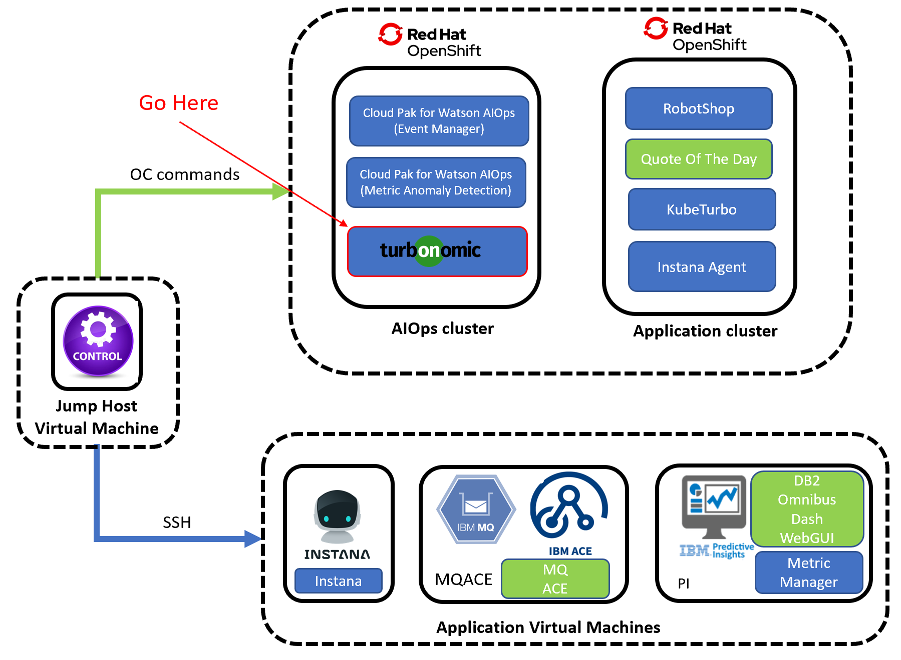

<AnchorLinks>
  <AnchorLink>4-1: Prerequisites</AnchorLink>
  <AnchorLink>4-2: Deploy the Operator</AnchorLink>
  <AnchorLink>4-3: Configure KubeTurbo Instance</AnchorLink>
  <AnchorLink>4-4: Validate Deployment</AnchorLink>
</AnchorLinks>

## 4-1: Prerequisites

1) As a cluster administrator, create a project in the OCP cluster where KubeTurbo will be deployed. 


Navigate to `Home -> Projects` and click on `Create Project` button. Fill in details as below.

- Name: `kubeturbo-operator`
- Display Name: `Operator Hub based deployment of kubeturbo`


2) Click on `Create` button.

***

## 4-2:  Deploy the Operator

1) Click on `Operators -> OperatorHub`. Ensure the `kubeturbo-operator` project is selected in the dropdown.

2) Search for `kubeturbo` keyword and select `Certified` KubeTurbo operator (note, do not use Community edition)


3) Select and click on `Install` button.


4) Select options as below. Set `Update approval` as `Manual`. Automatic update is not recommended if you are not also automatically updating the Turbo Server. Click on `Install` button


5) Click on `Approve` button when `Manual approval required` prompted.


6) The operator will install and when it's ready you can view the operator (Click on `View Operator`) to create an instance, which will be your KubeTurbo probe that will monitor and manage this cluster.


***

## 4-3:  Configure Kubeturbo Instance

1) When viewing the deployed operator, click on `Create instance`:


2) To configure this instance click on `YAML` option.

Refer to [Configure KubeTurbo Instance](https://github.com/turbonomic/kubeturbo/wiki/OpenShift-Operator-Hub-Details#configure-a-kubeturbo-instance) if you want to use `FORM` option


3) Replace all the contant in YAML editor view with the YAML config as below. **DO NOT CLICK CREATE YET!!**

```
kind: Kubeturbo
apiVersion: charts.helm.k8s.io/v1
metadata:
  name: kubeturbo-release
  namespace: kubeturbo-operator
spec:
  args:
    sccsupport: '*'
  image:
    repository: registry.connect.redhat.com/turbonomic/kubeturbo
    tag: <turbonomic server version>
  restAPIConfig:
    opsManagerPassword: <your turbonomic server password>
    opsManagerUserName: <your turbonomic server username>
  serverMeta:
    turboServer: <your turbonomic server URL, please use the topology-processor URL>
    version: <your turbonomic server version>
  targetConfig:
    targetName: <your cluster name>
```


4) Now, we need to replace `<your turbonomic server URL, please use the topology-processor URL>` with the actual turbonomic server URL. 

**How to get the Turbonomic Server URL?**

Go to the OCP cluster where turbonomic is installed.


Navigate to `Networking -> Routes` and select `turbonomic` project. Copy the `Location` in `topology-processor`.


Go back to your YAML editor view in Step 3 earlier. Assign it to `turboServer` value.


5) Next, replace the `<your turbonomic server version>` with the actual turbonomic server version.

**How to get the Turbonomic Server Version?**

Go back the OCP cluster where turbonomic is installed.


Navigate to `Networking -> Routes` and select `turbonomic` project. Click on the `Location` in `api`.

  

It will bring up the Turbonomic UI page as below. Check the version in the page.


Go back to your YAML editor view in Step 3 earlier. Assign it to 

- `image` -> `tag` value
- `serverMeta` -> `version` value  


6) Then replace the values of `<your turbonomic server password>` and `<your turbonomic server username>` with the credentials that you have used to login Turbonomic UI in Section 2.5 earlier.


7) When you have applied your configuration you will see that you have created an instance, or custom resource, called `kubeturbo-release`:


***

## 4-4:  Validate Deployment

1) You will now see two deployments and two running pods in the namespace. One is the operator, and the other is the Kubeturbo probe (release)

Navigate to `Workloads -> Pods` and select `kubeturbo-operator` project:


Navigate to `Workloads -> Deployment` and select `kubeturbo-operator` project:


2) Look at the log of the `kubeturbo-release` pod (In `Workloads -> Pods`) to validate that the probe has successfully connected, registered with the Turbo Server, and a full discovery has occurred. 


3) Validate the target in the Turbonomic Server UI

Go to your Turbonomic Server UI -> `Settings` -> `Target Configuration` and you will see a new target display with the name `Kubernetes-<your cluster name>`


***


