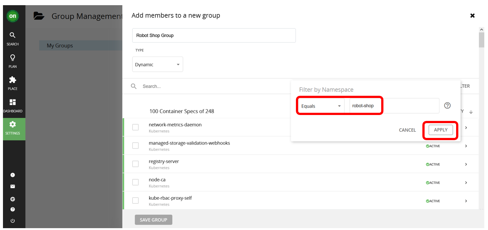
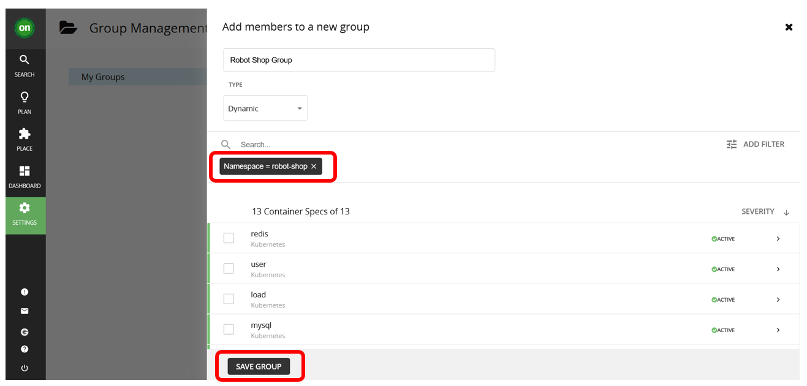
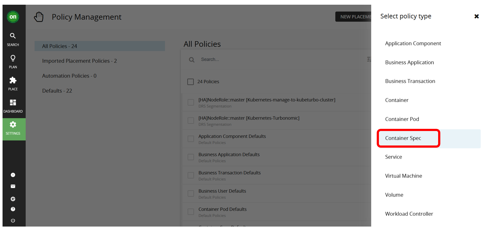
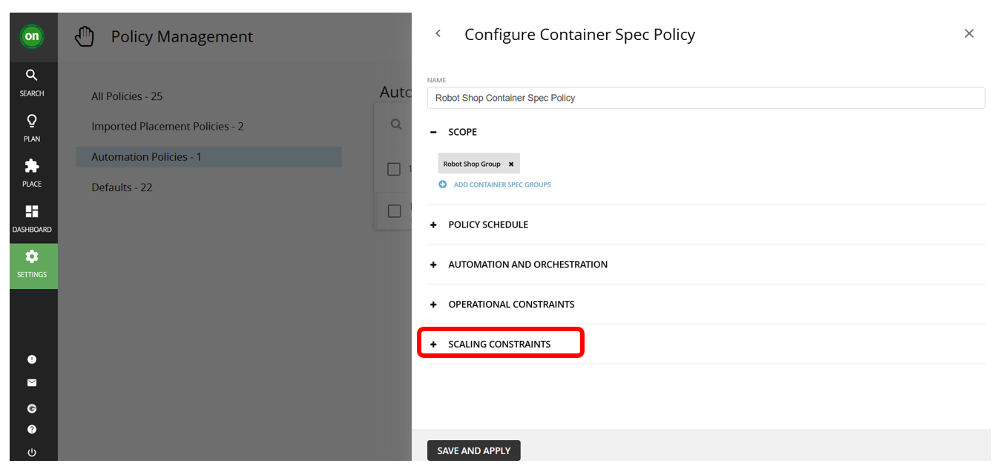

<AnchorLinks>
  <AnchorLink>6-1: Introduction</AnchorLink>
  <AnchorLink>6-2: Generate RobotShop Website Traffic</AnchorLink>
  <AnchorLink>6-3: Create Groups</AnchorLink>
  <AnchorLink>6-4: Set Up Policy</AnchorLink>
  <AnchorLink>6-5: Edit Policy</AnchorLink>
  <AnchorLink>6-6: Delete Policy</AnchorLink>
  <AnchorLink>6-7: Summary</AnchorLink>
</AnchorLinks>

## 6-1:  Introduction

- Turbonomic defines a set of default policies for each entity type however users can define their own policies for each entity in supply chain based on business requirements. 
- Policies define business rules to control how analyzes resource allocation, how it displays resource status, and how it recommends or executes actions.

***

## 6-2:  Generate RobotShop Website Traffic

1) Go to the OCP cluster that is running RobotShop application


2) Copy the RobotShop's real route URL. You can get it from `Networking -> Routes` and select `robot-shop` project. Copy the `Location`.


3) From your command prompt, set the `ROBOTSHOP_URL` to the value copied in previous Step 2.

```sh
export ROBOTSHOP_URL=<robot-shop app's real route URL>
```

4) Use Selenium-based `load-gen` from Bright Zheng [here](https://github.com/brightzheng100/robot-shop/tree/selenium-load-gen/selenium) as it generate better traffic for website monitoring. Then run the command below:

```sh
oc -n robot-shop apply -f - <<EOF
apiVersion: apps/v1
kind: Deployment
metadata:
  name: rs-website-load
  labels:
    service: rs-website-load
spec:
  replicas: 30
  selector:
    matchLabels:
      service: rs-website-load
  template:
    metadata:
      labels:
        service: rs-website-load
    spec:
      containers:
      - name: rs-website-load
        env:
          - name: HOST
            value: "${ROBOTSHOP_URL}"
        image: brightzheng100/rs-website-load:latest
EOF
```

5) Verify the `rs-website-load-xxx` pod is created:

```sh
oc get pods -n robot-shop
```

Example output:

```
NAME                              READY   STATUS              RESTARTS       AGE
cart-7d7745696b-wl26d             1/1     Running             0              14h
catalogue-998b69bc9-6cgwk         1/1     Running             0              14h
dispatch-69b65d89b9-w5kd4         1/1     Running             0              14h
load-56b554db46-5568w             1/1     Running             1 (179m ago)   14h
mongodb-67c5456f4-s8rqr           1/1     Running             0              14h
mysql-6d778f4c8f-xh7wv            1/1     Running             0              14h
payment-5465d9cc79-62ksx          1/1     Running             0              14h
rabbitmq-785b678f74-bg5m4         1/1     Running             0              14h
ratings-7ccf67b49f-szbf4          1/1     Running             0              14h
redis-0                           1/1     Running             0              14h
rs-website-load-779f86d45-6rjwg   0/1     ContainerCreating   0              79s
shipping-7f6dfbf46f-8hcqt         0/1     Running             11 (67m ago)   14h
user-899b6c7ff-kbrwj              1/1     Running             0              14h
web-5476dc8495-qphxc              1/1     Running             0              14h
```

6) Go to your Instana dashboard and verify that the `Page Views` count for Robot Shop website has increased.


***

## 6-3:  Create Groups

Groups
- Groups are collection of like entities.
- Groups can be used any place where you can scope
- Some groups are automatically created

Now we first need to create the group containing RobotShop business application.

1) Click on `Settings -> Groups`


2) Click on `NEW GROUP`


3) Click on `Business Application`


4) Enter the group name as `Robot Shop Group` and select `Dynamic` type

```
Static vs Dynamic
- use Dynamic groups if there is criteria which can define your group
- use Static groups when
  - You do not expect membership to ever change
  - There are no criteria that can be used to define the group
```


5) Click on `ADD FILTER` and select `NAME`

6) Select filter `Equals` and enter the regular expression `.*robot.*`. Click `Apply` button



7) Click on `SAVE GROUP`



8) You will see the `Robot Shop Group` newly created.


## 6-4:  Set Up Policy

1) Go to Turbonomic UI and click on `Settings`:


2) Then choose `Policies`


3) Then click on `NEW AUTOMATION POLICY`


4) Select `Business Application` policy for the Robot Shop application.



5) Fill in the name `Robot Shop Response Time SLO Policy`. Click on `ADD BUSINESS APPLICATION GROUP`. 


6) Tick on the `Robot Shop Group` and click on `SELECT` button.


7) Expand `Operational Constraints` section

 

8) Select the following operation constraints for Response Time SLO of 1ms


Then click `SAVE AND APPLY` button. With the policy configured, Turbonomic will analyze performance data over time and then provide placement and resource sizing recommendations.

9) The scoped policy you have created can be found in the `Automation Policies`


10) The `Imported Placement Policies` is specifically for imported on-prem policies


11) The `Defaults` filter represents the policies that govern entire entity types


***

## 6-5:  Edit Policy

To edit a policy, click on the policy. Example:


***

## 6-6:  Delete Policy

18) To delete a policy. Example:


***

## 6-7:  Summary

In this section, you have learned to generate RobotShop Website Traffic, use the policy editor to create group (scoped) policies. Next, we will look at how to take actions.

***

