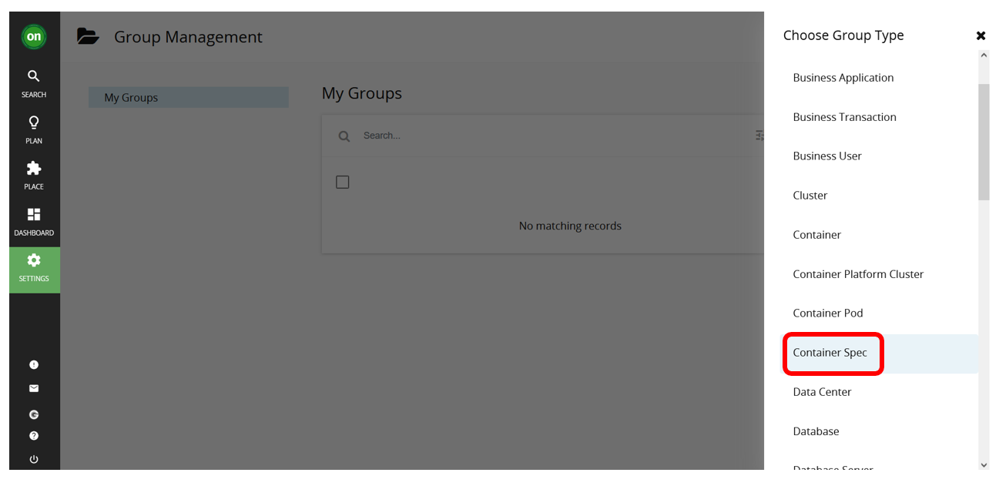
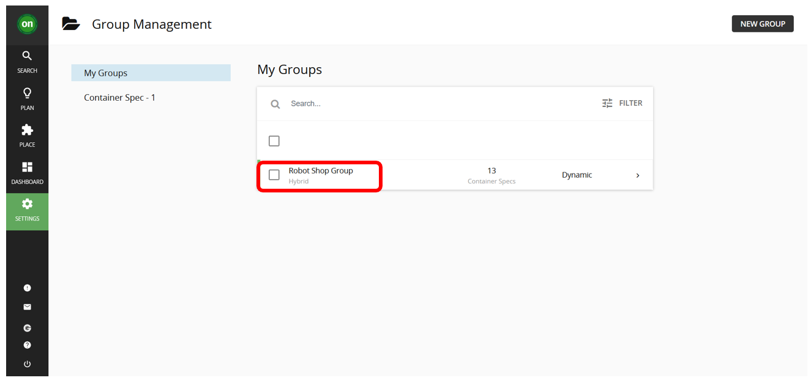
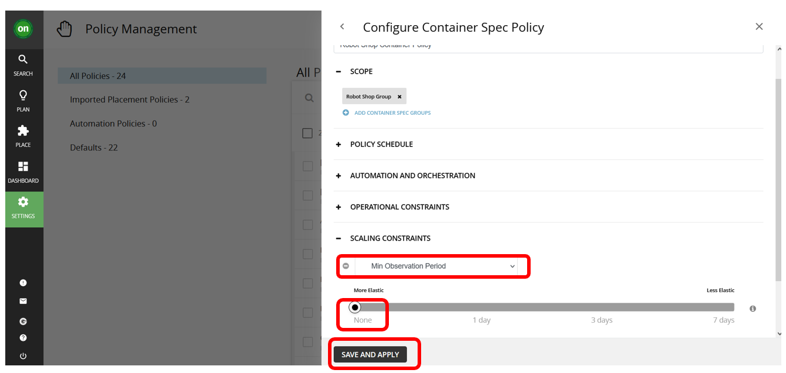
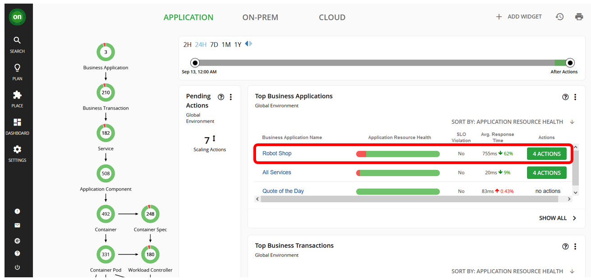

<AnchorLinks>
  <AnchorLink>6-1: Introduction</AnchorLink>
  <AnchorLink>6-2: Generate RobotShop Website Traffic</AnchorLink>
  <AnchorLink>6-3: Create Groups</AnchorLink>
  <AnchorLink>6-4: Setup a Policy</AnchorLink>
  <AnchorLink>6-5: Editing a Policy</AnchorLink>
  <AnchorLink>6-6: Deleting a Policy</AnchorLink>
  <AnchorLink>6-7: Summary</AnchorLink>
</AnchorLinks>

---

## 6-1: Introduction

Turbonomic defines a set of default policies for each entity type which are
used to analyze data and make action recommendations.

Ssers can define their own policies for each entity in the supply chain based
on business requirements.

Policies define business rules to control how Turbonimic

- analyzes resource allocation.
- displays resource status
- recommends or executes actions.

In this lab, you will configure an SLO policy for the Robot Shop application
to understand how Turbonomic ARM uses target data already configured to
make action recommendations that will assure application performance.

---

## 6-2: Generate RobotShop Website Traffic

1. Go to the **manage-to** OpenShift cluster console, where RobotShop is running:

   

1. Login into the OpenShift Console UI (`manage-to` cluster) and get your
   login token:

   - From the OpenShift console, click your username in the top-right.
   - Select the _Copy login command_ menu item.
   - From the new tab that opens, copy the login command from the
     **Log in with this token** section.
   - Paste the copied command into your SSH terminal on your control node and
     press enter to login.

   Validate you are logged into the correct cluster. You should see the
   Robot Shop pods running:

   ```sh
   oc get pods -n robot-shop
   ```

1. On your **control** node, set the `ROBOTSHOP_URL` environment variable:

   ```sh
   export ROBOTSHOP_URL=http://$(
    oc get route -n robot-shop | grep web | awk '{print $2}'
   )
   ```

1. Use the Selenium-based `load-gen` from <a href="https://github.com/brightzheng100/robot-shop/tree/selenium-load-gen/selenium" target="_blank">Bright Zheng</a> as
   it generate good traffic for website monitoring:

   ```sh
   oc -n robot-shop apply -f - <<EOF
   apiVersion: apps/v1
   kind: Deployment
   metadata:
     name: rs-website-load
     labels:
       service: rs-website-load
   spec:
     replicas: 100
     selector:
       matchLabels:
         service: rs-website-load
     template:
       metadata:
         labels:
           service: rs-website-load
       spec:
         containers:
         - name: rs-website-load
           env:
             - name: HOST
               value: "${ROBOTSHOP_URL}"
           image: brightzheng100/rs-website-load:latest
   EOF
   ```

1. Verify the `rs-website-load-xxx` pod is created:

   ```sh
   oc get pods -n robot-shop
   ```

   **Example output:**

   ```
   NAME                              READY   STATUS              RESTARTS       AGE
   cart-7d7745696b-wl26d             1/1     Running             0              14h
   catalogue-998b69bc9-6cgwk         1/1     Running             0              14h
   dispatch-69b65d89b9-w5kd4         1/1     Running             0              14h
   load-56b554db46-5568w             1/1     Running             1 (179m ago)   14h
   mongodb-67c5456f4-s8rqr           1/1     Running             0              14h
   mysql-6d778f4c8f-xh7wv            1/1     Running             0              14h
   payment-5465d9cc79-62ksx          1/1     Running             0              14h
   rabbitmq-785b678f74-bg5m4         1/1     Running             0              14h
   ratings-7ccf67b49f-szbf4          1/1     Running             0              14h
   redis-0                           1/1     Running             0              14h
   rs-website-load-779f86d45-6rjwg   0/1     ContainerCreating   0              79s
   shipping-7f6dfbf46f-8hcqt         0/1     Running             11 (67m ago)   14h
   user-899b6c7ff-kbrwj              1/1     Running             0              14h
   web-5476dc8495-qphxc              1/1     Running             0              14h
   ```

1. Go to your Instana dashboard and verify that the `Page Views` count for the
   Robot Shop website has increased:

   

---

## 6-3: Create Groups

In Turbonomic ARM, groups:

- are a collection of like entities.
- can be used any place where you can scope.
- are automatically created in some cases.

Now we first need to create the group containing the Robot Shop business
application.

In the Turbonomic ARM user interface:

1. Click on `Settings -> Groups`:

   

1. Click on `NEW GROUP`:

   

1. Click on `Business Application`:

   

1. Enter the group name as `Robot Shop Group` and select the `Dynamic` type:

   > **Static vs Dynamic**
   >
   > - use Dynamic groups if there is criteria which can define your group.
   > - use Static groups when:
   >   - You do not expect membership to ever change.
   >   - There is no criteria that can be used to define the group.

   

1. Click on `ADD FILTER` and select `NAME`

1. Select filter `Equals` and enter the regular expression `.*robot.*`, then
   click the `Apply` button:

   

1. Click on the `SAVE GROUP` button:

   

You should now see the `Robot Shop Group` newly created.



---

## 6-4: Setup a Policy

1. Go to the Turbonomic ARM homepage and click on `Settings`:

   

1. Then choose `Policies`:

   

1. Then click on `NEW AUTOMATION POLICY`:

   

1. Select `Business Application` as the policy type for the Robot Shop
   application:

   

1. Fill in the name as `Robot Shop Response Time SLO Policy` and click on
   `ADD BUSINESS APPLICATION GROUP`:

   

1. Select the `Robot Shop Group` checkbox and click on the `SELECT` button.

   

1. Expand the `OPERATIONAL CONSTRAINTS` section:

   

1. Configure the operational constraints as in the image below to set up a
   response time SLO:

   

1. Then click the `SAVE AND APPLY` button. With the policy configured,
   Turbonomic will analyze performance data over time and then provide placement
   and resource sizing recommendations.

1. The scoped policy you have created can be found in the `Automation Policies`
   category:

   

1. The `Imported Placement Policies` category is specifically for imported
   on-prem policies:

   

1. The `Defaults` category represents the policies that govern entire entity
   types.

   

1. Now go back to the Turbonomic dashboard. **Wait for about 15 mins** and you will notice there is
   an `SLO Violation` now on the Robot Shop application:

   

---

## 6-5: Editing a Policy

> **Note:** This is for information only, there is no need to actually edit
> any policy for these labs.

To edit a policy, click on the policy:


Make your changes and save.

---

## 6-6: Deleting a Policy

> **Important:** This is for information only, do not delete any policy for
> these labs.

18. To delete a policy:


---

## 6-7: Summary

In this section, you have learned how to create a scoped policy for a business
application, in this case to govern an application response time SLO.

Then, generate website traffic for the Robot Shop application to trigger an SLO
violation.

Next, we will look at how to take actions to assure appication performance.

---
