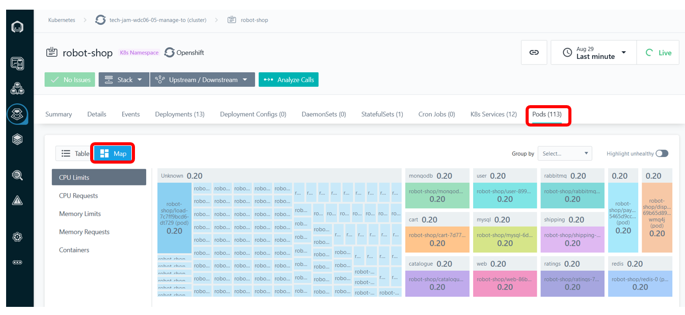
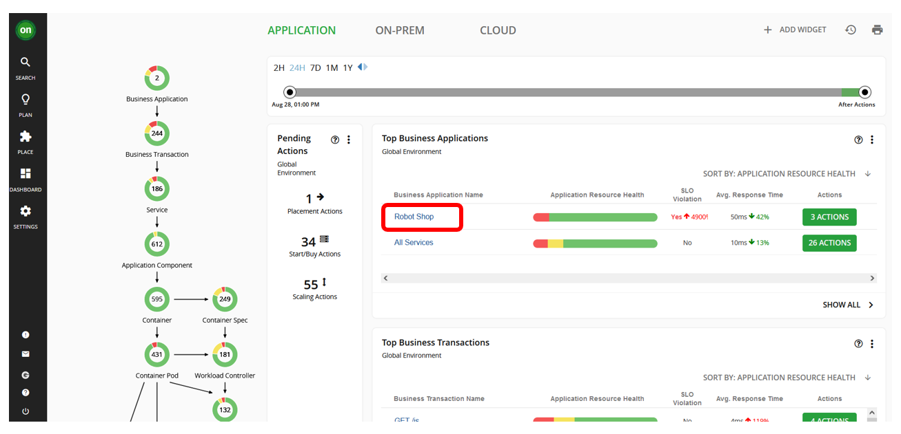
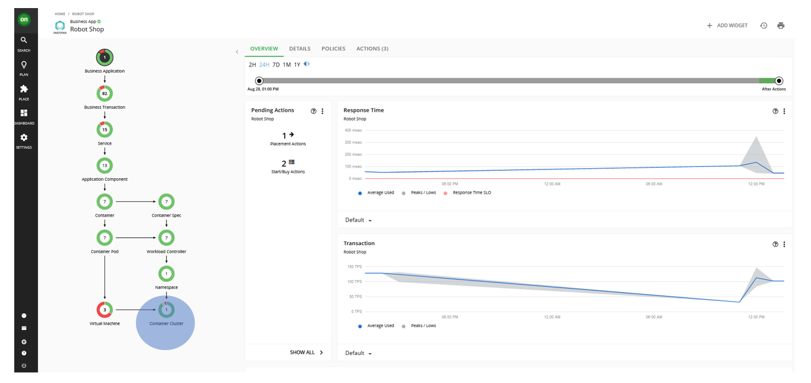
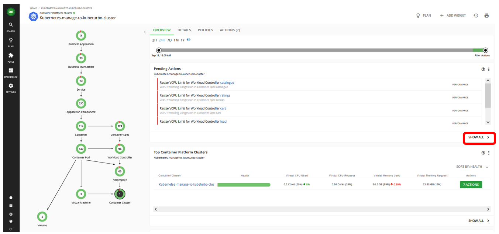
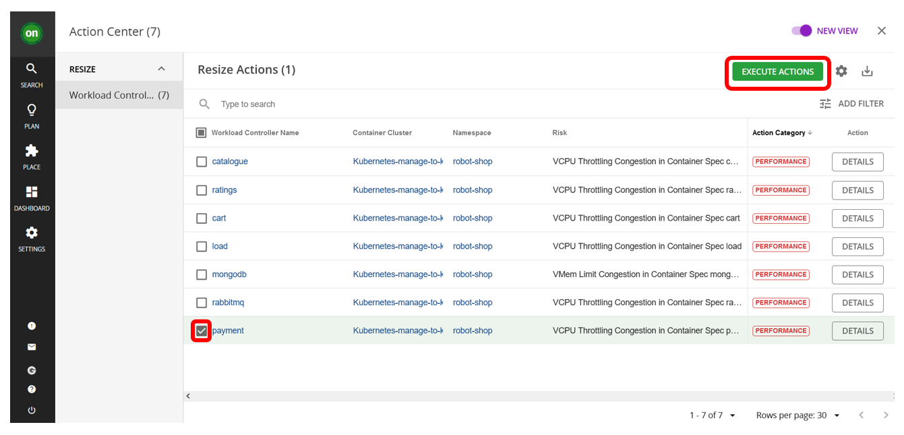
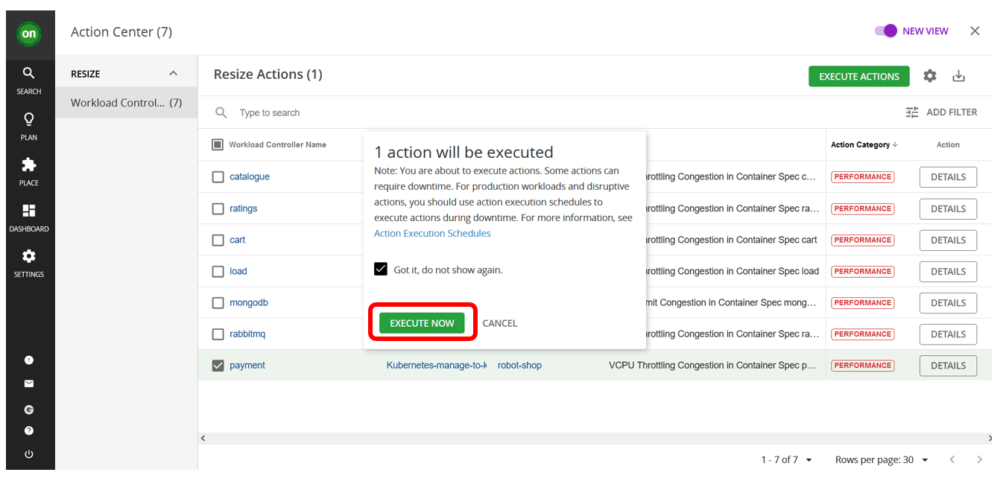
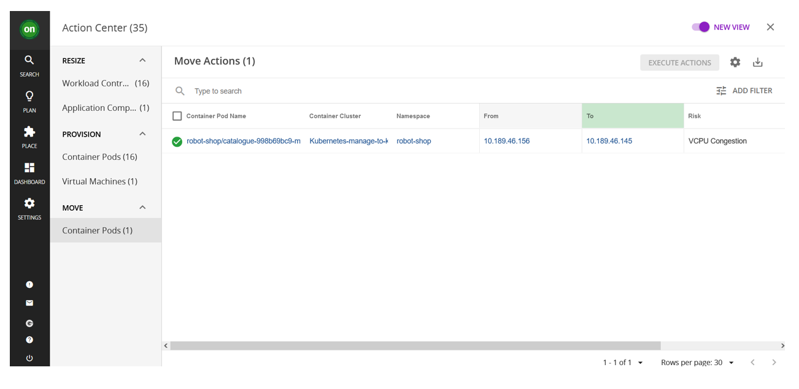

<AnchorLinks>
  <AnchorLink>7-1: Manage Performance of Your Application</AnchorLink>
  <AnchorLink>7-2: Summary</AnchorLink>
</AnchorLinks>

## 7-1: Manage Performance of Your Application

1. Open your Instana dashboard. Navigate to `Platform -> Kubernetes`.
   

2. Select your Robot Shop cluster.

3. Under `Namespaces` tab, select `robot-shop`.

4. Click on `Pods` tab and choose the `Map` view. Analyze the CPU Limits, CPU Requests, Memory Limits, and Memory Requests. For example, here's what the CPU Limits looked like for Robot Shop app before any improvements:

5. Then go to Turbonomic dashboard and navigate to `Robot Shop` application.

6. Here, we can see come key application metrics provided by Instana � e.g. response time and transaction and how they have evolved over time. Turbonomic uses that data to provided actionable insights based on that data in the form of recommended actions you could take to improve performance and/or improve efficiency.

You will noticed either yellow or red and green sections of the circles on `Container Cluster` section of the Business Application Tree on the left side of the screen.

7. Click that circle and it will take you to a screen like this below. You will notice that there are `Pending Actions` that Turbonomic suggests will improve the performance and efficiency of the application.

Turbonomic does not recommend actions for a Business Application, Transactions, or Services, but it does recommend actions for the underlying Application Components and infrastructure entities, thus providing visibility into the risks that have a direct impact on the Business Application's performance.

8. Click `SHOW ALL` in the `Pending Actions` section.

9. Then select the pending actions that are for Robot Shop application. Once they are selected, click on `EXECUTE ACTIONS` to apply the actions.

10. Click on `EXECUTE NOW` when a pop up window stating `1 action will be executed`

Action successfully executed

11. After a few mins, you can go back to the Instana dashboard to view improvements. You should see that despite changes in resource utilization by the Robot Shop services, response time will either improve or remain the same.

---

## 7-2: Summary

In this section, you have learned to execute actions based on Turbonomic recommendations.

---
