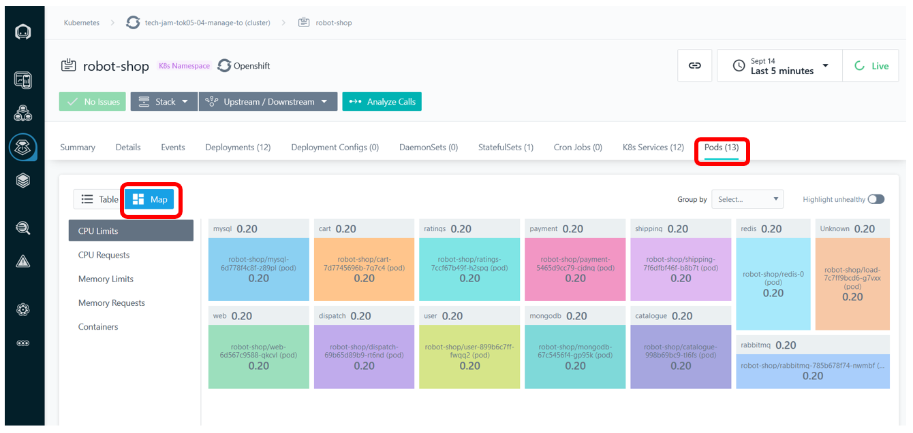
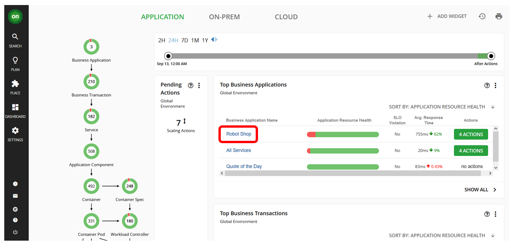
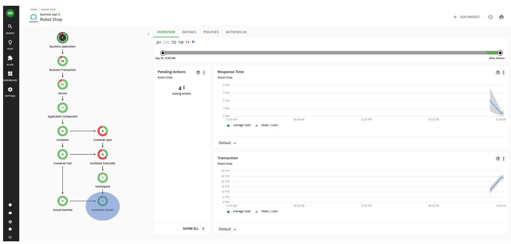
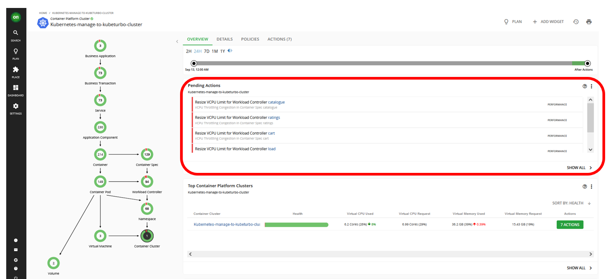

<AnchorLinks>
  <AnchorLink>7-1: Introduction</AnchorLink>
  <AnchorLink>7-2: Manage Performance of Your Application</AnchorLink>
  <AnchorLink>7-3: Summary</AnchorLink>
</AnchorLinks>

## 7-1:  Introduction

- Turbonomic defines a set of default policies for each entity type however users can define their own policies for each entity in supply chain based on business requirements. 
- Policies define business rules to control how analyzes resource allocation, how it displays resource status, and how it recommends or executes actions.

***

## 7-2:  Manage Performance of Your Application

1) Open your Instana dashboard. Navigate to `Platform -> Kubernetes`. 

2) Select your Robot Shop cluster.

3) Under `Namespaces` tab, select `robot-shop`. 

4) Click on `Pods` tab and choose the `Map` view. Analyze the CPU Limits, CPU Requests, Memory Limits, and Memory Requests. For example, here's what the CPU Limits looked like for Robot Shop app before any improvements:

5) Then go to Turbonomic dashboard and navigate to `Robot Shop` application. 

6) You will noticed either yellow or red and green sections of the circles on `Container Cluster` section of the Business Application Tree on the left side of the screen. 

7) Click that circle and it will take you to a screen like this below. You will notice that there are `Pending Actions` that Turbonomic suggests will improve the performance and efficiency of the application.

8) Click `SHOW ALL` in the `Pending Actions` section. 

9) Then select the pending actions that are for Robot Shop application. Once they are selected, click on `EXECUTE ACTIONS` to apply the actions.

10) You can view progress in your OpenShift console. After a few mins, you can go back to the Instana dashboard to view improvements. You should see that despite changes in resource utilization by the Robot Shop services, response time will either improve or remain the same.

***

## 7-3:  Summary

In this section, you have learned to execute actions based on Turbonomic recommendations.

***

