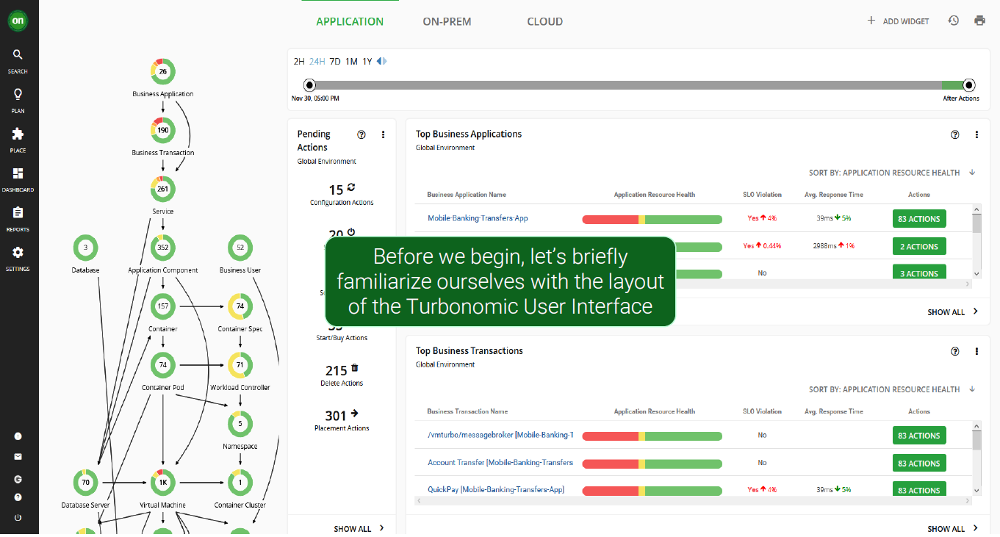
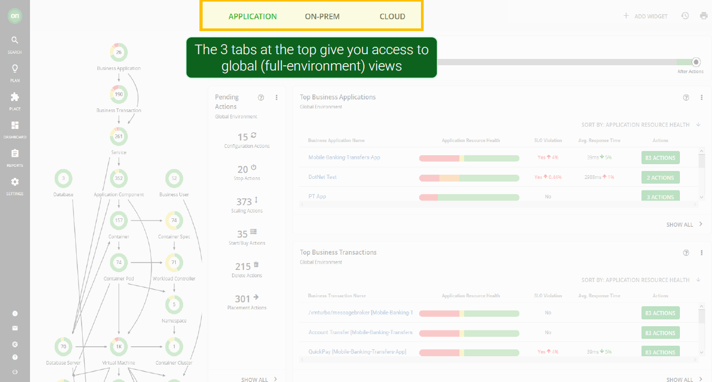

<AnchorLinks>
  <AnchorLink>3-1: Turbonomic UI</AnchorLink>
  <AnchorLink>3-2: Business Application Drill Down</AnchorLink>
</AnchorLinks>

## 3-1:  Turbonomic UI

Navigate to the Turbonomic UI home page

When the Turbonomic ARM is deployed and selected environments are targeted, Turbonomic discovers all of the entities in the targeted environments. It then builds out this graphic you see here called the supply chain, stitching together all of the entities from the top-level business application down through the supporting infrastructure.

On this home page, there are widgets for `Top Business Applications`, `Top Business Transactions`, and `Top Services` that allow you to quickly assess the risk to the running applications. Not only can you quickly see the applications with the highest risk, but you can also click `Show All` to see the complete list of Business Applications and relevant metrics.

***

## 3-2:  Business Application Drill Down

Click on `Robot Shop` application from the `Top Business Applications` widget.

When you scope to this business application, the supply chain has changed from showing all of the entities in the global environment to only the entities that are relevant to this specific application.

This business application consists of X business transactions, X services and X application components.

Notice that the entities have different colors where:

- `red` indicates performance risk where entities need to be moved to a more optimal host or scaled up because of resource congestion or under-provisioning
- `yellow` indicates efficiency opportunities where resources can be reclaimed due to overprovisioning; and
- `green` indicates entities in their desired state, which is what we are after.

***

